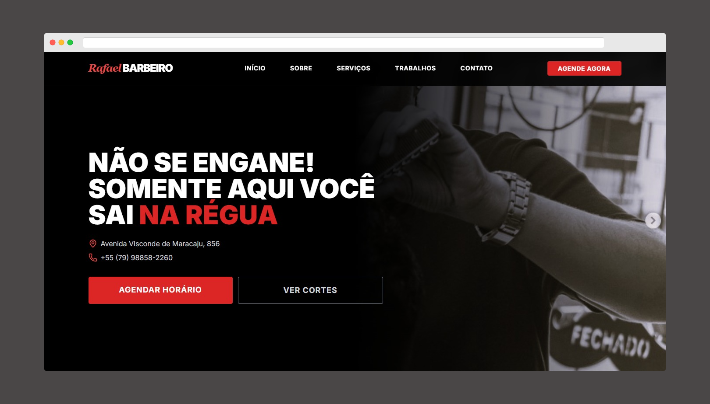

# Rafael Barbeiro - Landing Page

> Site institucional desenvolvido para a Barbearia Rafael.

## 🔗 Acesse o Projeto
Clique aqui para ver o site no ar: **[https://rafael-barbearia.vercel.app/](https://rafael-barbearia.vercel.app/)**

## 🛠 Tecnologias
- HTML5
- CSS3 (Tailwind CSS)
- JavaScript

✨ Funcionalidades
 * [x] Design totalmente responsivo (Celular e PC)
 * [x] Galeria de vídeos com filtro por categoria (Degradê, Nevou, etc.)
 * [x] Menu de navegação mobile
 * [x] Integração com WhatsApp

## 📝 Sobre
Este projeto foi desenvolvido com foco em performance e design responsivo (Mobile First). Ele simula a presença digital de uma barbearia real, permitindo aos usuários visualizarem serviços, galeria de cortes e entrarem em contato via WhatsApp.
Projeto criado para compor meu portfólio acadêmico em Análise e Desenvolvimento de Sistemas.

